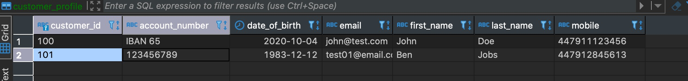

# Odyssey-OLB

## Prerequisites
node 12.14+
npm 6.13+

## How to run
- git submodule update --init --recursive
- npm install
- npm start

## Lint check
npm run lint

## Link check and fix
npm run lint:fix

## Unit Tests

npm run test

Launches the test runner in the interactive watch mode. 
See the section about [running tests](https://facebook.github.io/create-react-app/docs/running-tests) for more information.

npm run test:cov

Runs all the tests and generates the coverage report for the same. You can view the overall coverage in the terminal itself and also the coverage report with more detail can be found in the /coverage directory

## How to build prod
npm run build

## Docker build
To pack the build in a docker image, run the following:
`docker build -t olb-web:latest .`

Then you can run it like this:
`docker run -p 127.0.0.1:8080:80 olb-web`
Now you can visit it at http://localhost:8080

### Configurtaion

The configurtaion is in:
src\config\index.tsx

- BASE_API_PATH, the server api base path

noActivity = {
  notificationTimeout: 1000 * 60 * 1, // 1 mins(60 seconds)
  logoutTimeout: 1000 * 60 * 0.2 // 0.2 mins(12 seconds)
}

## Notes

1.The valid login userId and passcode of Login page is:

  userId: test01
  passcode: 123456

  The valid temporary login userId and passcode of Login page is:
  userId: tempuser01
  passcode: 123456

2."Contact information" screen of Registration page:
  valid email: test01@email.com
  valid phone number like: +44 7405021747
User can use similar format of the above values,but will show "Unmatched" error message.

3.Reset Passcode page:
The user id is: test01

3.The valid OPT code in all pages is 232323

4.The page of service error is:
http://localhost:3000/serviceError
Using a independent page of "service error" is for maintaining clean code of other pages.

5.The page of account locked is:
http://localhost:3000/accountLocked
This page will also be shown during the workflow in login page.

6.public\data\dataUnLockQuestiones.json:
this file contains the unlock questiones' answers.

7.RecoverUserID page:
the valid "Sort code" value is "123456"

8.Activity Detection in Customer Dashboard page:
D - 03 - 8a.png will be shown 60 seconds after the page opens and no user actions(clicking and mouse moving),
D - 03 - 8b.png will be shown 6 seconds after show D - 03 - 8a.png.

9.Manage Card page:
the valid OPT code is "232323"

10.Account Alerts page:
there is a random to show the save error message(50% probability),
and it will disappear after 5 seconds.

11."Income & Outgoings" tab of "Finance Manager" page:
Select "Last 7 days" will show the example of "There are no transactions for this account for the selected tenure" content.

12.Marketing Preferences modal window
To mockup the case of having Last Updated date,
it shows randomly by 50% chance,the user can re-open the modal window to see the different cases.

## Integrate Verify

- Registation, use these rows for registation 
- Login, After registation, you will got userId and password in email box, then use these to login
- Recover User Id,  enter the right account number and any sort code, any date of birth to recover userId

## Firebase

To change the Firebase app, go to `src/config/firebase.ts` and change `firebaseConfig` to the configuration you're given in the Firebase dashboard.

If you set `firebaseConfig` to `null`, the Firebase integration will be disabled.

Additionally, you can set `PRODUCTION_ONLY` to `true` to disable Firebase during development and only track the analytics once the app is built/deployed in production.

## Verification
Please run `npm install` first, there are some new node modules has been added.
1. Click the `Book appointment` button, the URL will go to `/contactRM/BookAppointment` routes. In the right container you will see the whole flow of book appointment.
2. When you finish the each step from, the `Continue` button will be available.
3. Click the `edit-icon` will go back to the specified step, and the data user inputed would be save.
4. The `Update Appointment ` edit feature shared the same components with `Book Appointment` flow.
